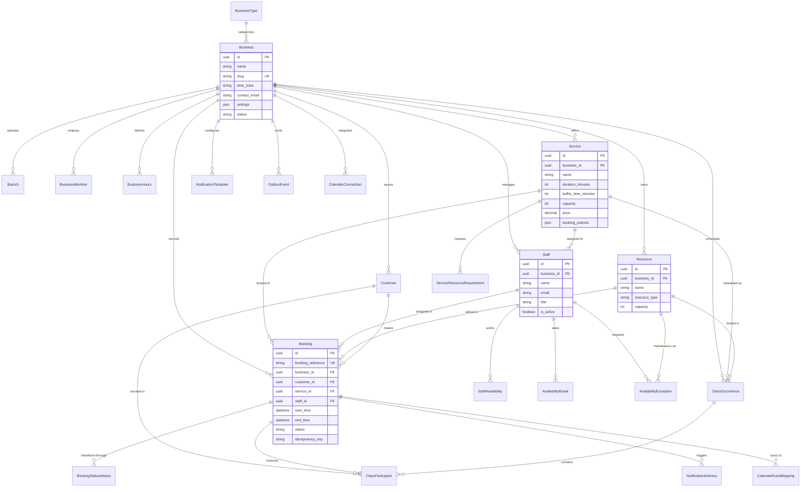

# Entity Relationship Diagram (ERD)

```mermaid
erDiagram
    BusinessType ||--o{ Business : "categorizes"
    Business ||--o{ Branch : "operates"
    Business ||--o{ BusinessMember : "employs"
    Business ||--o{ BusinessHours : "defines"
    Business ||--o{ Service : "offers"
    Business ||--o{ Staff : "manages"
    Business ||--o{ Resource : "owns"
    Business ||--o{ Customer : "serves"
    Business ||--o{ Booking : "records"
    Business ||--o{ ClassOccurrence : "schedules"
    Business ||--o{ NotificationTemplate : "configures"
    Business ||--o{ OutboxEvent : "emits"
    Business ||--o{ CalendarConnection : "integrates"

    Service ||--o{ ServiceResourceRequirement : "requires"
    Service ||--o{ Staff : "assigned to"
    Service ||--o{ Booking : "booked in"
    Service ||--o{ ClassOccurrence : "scheduled as"

    Staff ||--o{ StaffAvailability : "works"
    Staff ||--o{ AvailabilityBreak : "takes"
    Staff ||--o{ AvailabilityException : "requests"
    Staff ||--o{ Booking : "assigned to"

    Resource ||--o{ AvailabilityException : "maintenance on"
    Resource ||--o{ Booking : "utilized in"
    Resource ||--o{ ClassOccurrence : "hosted in"

    Customer ||--o{ Booking : "makes"
    Customer ||--o{ ClassParticipant : "enrolled in"

    Booking ||--o{ BookingStatusHistory : "transitions through"
    Booking ||--o{ ClassParticipant : "reserves"
    Booking ||--o{ NotificationDelivery : "triggers"
    Booking ||--o{ CalendarEventMapping : "syncs to"

    ClassOccurrence ||--o{ ClassParticipant : "contains"

    Business {
        uuid id PK
        string name
        string slug UK
        string time_zone
        string contact_email
        json settings
        string status
    }

    Service {
        uuid id PK
        uuid business_id FK
        string name
        int duration_minutes
        int buffer_time_minutes
        int capacity
        decimal price
        json booking_policies
    }

    Resource {
        uuid id PK
        uuid business_id FK
        string name
        string resource_type
        int capacity
    }

    Staff {
        uuid id PK
        uuid business_id FK
        string name
        string email
        string title
        boolean is_active
    }

    Booking {
        uuid id PK
        string booking_reference UK
        uuid business_id FK
        uuid customer_id FK
        uuid service_id FK
        uuid staff_id FK
        datetime start_time
        datetime end_time
        string status
        string idempotency_key
    }
```
